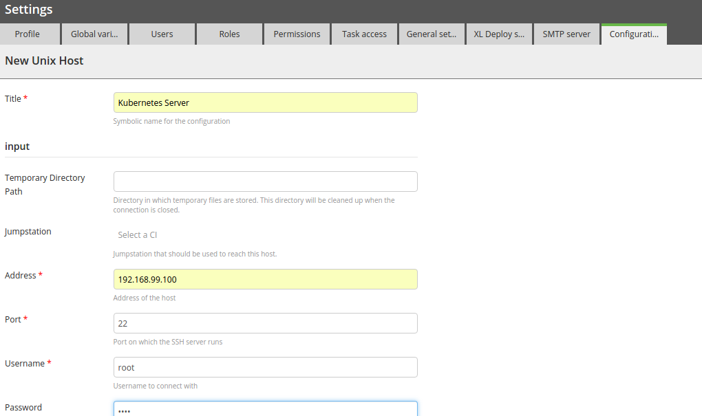

# xlr-kubernetes-plugin

## Usage

This plugin is primarily aimed to create/destroy Kubernetes resources on a Kubernetes host. To use the plugin we need to add it to the plugins directory of xl-release.
 
Once this plugin is added to xl-release, types such as Kubernetes host and tasks specific to create/remove Kubernetes resources are available.

## Defining a Unix host
We need to define a Unix host as the first thing under configurations. 

A Unix host running kubernetes requires following fields to be specified

*address - Ip Address/Hostname of the remote machine running the Kubernetes cluster

*port - the SSH port of the remote machine

*username - ssh username

*password - ssh password

*sudoUsername - Sudo username on the remote machine(e.g root)

Once this host is created, we now need to create a release with tasks for creating/removing Kubernetes resources.

## Create Resource Task

In the newly created release add a task of type *Kubernetes Create resource*. This task requires the user to specify input configuration for Kubernetes in Json format.

There are two ways to specify the Json input , user can simply add the json as plain text in field spec or it can be specified as a URL. If URL is secured, user needs to provide a valid username and password as well.

## Wait Task

Once the configuration is done , the user can additionally add another step to wait for the created resource to be in running state. This can be achieved by specifying following command in a text field labelled *command* 

*kubectl describe pods/<name_of_the_pod>*

Command field in wait task can take any command the user wants to execute to wait on the resource. Additionally the user can specify a regex that should match the output of command executed in field labelled *pattern*. Once the regex specified the output
wait step is considered successful and the release moves to the next task/phase to execute.
 
## Remove Resource Task
 
Similarly for removing the Kubernetes resource, user needs to create a task of type  *Kubernetes remove resource* and provide same Json input as specified in the create task.

